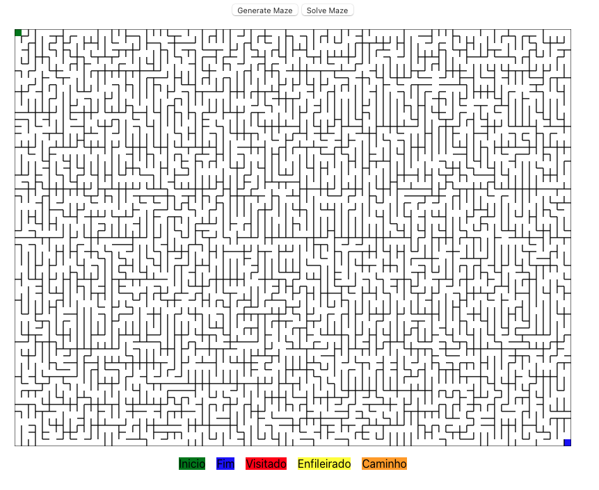
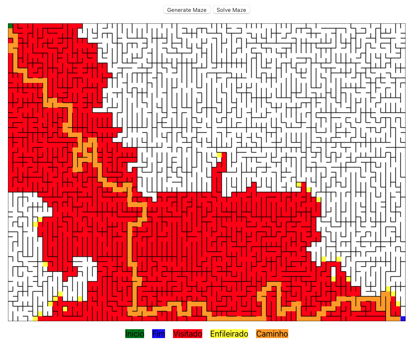
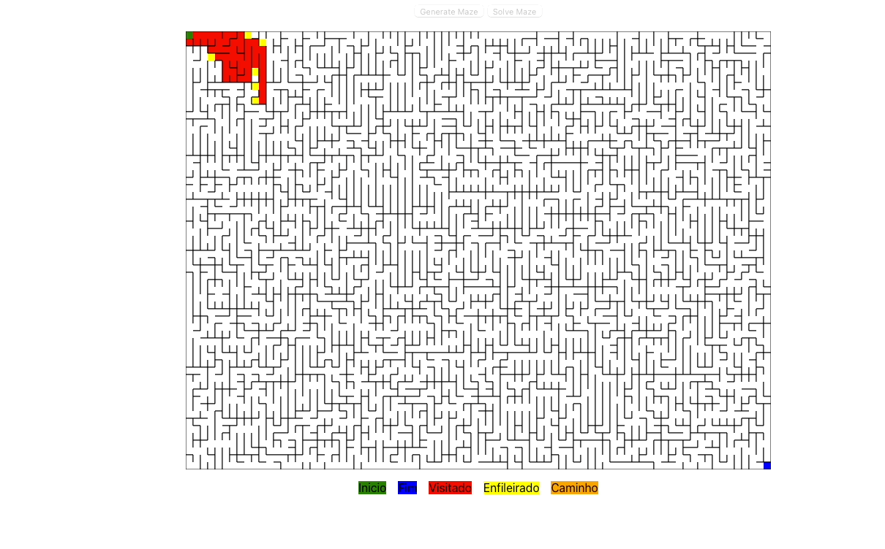

# A\* Visualizer 

**Número da Lista**: 6<br>
**Conteúdo da Disciplina**: Final<br>

## Alunos
|Matrícula | Aluno |
| -- | -- |
| 16/0028361 |  Gabriel Batista Albino Silva|

## Sobre 
O projeto tem como objetivo facilitar a compreensão do funcionamento do algoritmo A*.
O algoritmo A* é utilizado para encontrar o caminho mais curto entre dois nós em um grafo.
Ele é um algoritmo guiado, isto é, utiliza uma função heuristica para obter informações a respeito da proximidade do objetivo a ser alcançado e utiliza isso para tomar a melhor decisão de caminho.

Foi utilizado um labirinto para representar o grafo, onde cada área do labirinto se portava como um nó e as arestas são representadas pela ausência de paredes.
Abaixo é possível conferir a estrutura de um nó do grafo:
```
interface Cell {
  x: number;
  y: number;
  top: boolean;
  bottom: boolean;
  left: boolean;
  right: boolean;
  set: number;
  visited?: boolean;
  queued?: boolean;
}
```
Onde:
* X e Y é a posição ocupada pelo nó na matriz. 
* Top, Bottom, Left e Right indicam a presença ou ausência de caminho conectado o nó atual ao nó acima, abaixo, á direita ou á esquerda respectivamente.
* Set é uma propriedade utilizada pela biblioteca que gera o labirinto
* Visited e Queued é utilizado para represetnar os elementos graficamente.

Portanto, caso um nó tenha apenas a propriedade "Right" falsa, isso indica que, no labirinto, a parede á direita desse nó não existe e ele só está conectado com o nó a sua direita.

No contexto da aplicação, a função heurística escolhida para calcular a distância do nó atual ao destino foi a distância abosoluta entre os pontos, exibida abaixo:

`f(x) = g(x) + h(x)`, onde `g(x)` corresponde á distância do nó atual (X) ao inicio e `h(x)` representa a estimativa do menor caminho de X até o objetivo.


A função responsável por estimar a distância encontra-se abaixo.

```
  findDistance(cell1: Cell | Point, cell2: Cell | Point){
    const x1 = cell1.x;
    const y1 = cell1.y;
    const x2 = cell2.x;
    const y2 = cell2.y;
    const distance = Math.abs(x1 - x2) + Math.abs(y1 - y2);
    return distance;
  };

```

Portanto, utiliza-se uma `fila de prioridade` para obter sempre o nó com mais chances de ser o correto para alcançar o objetivo final.

## Screenshots




## Instalação 
**Linguagem**: JS/TS<br>
**Framework**: React<br>

Utilizado node v16.13.0.
Para iniciar o projeto, acessar o diretório path-finder e executar os comandos abaixo:

```
npm install
npm start

```

## Uso
Use o botão "Generate Maze" para gerar novos labirintos
Use o botão "Resolve Maze" para visualizar o algoritmo A* procurando a saída
